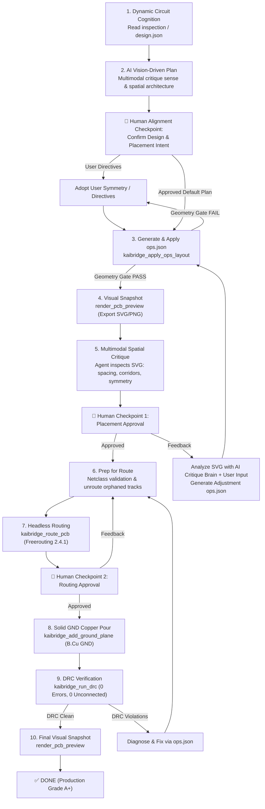

# Agentic Placement Architecture

**The Core Architecture (Vision-Guided Semantic Placer):**
To solve the problem of LLMs lacking sub-millimeter geometry awareness, you **MUST** strictly act as the **Lead Hardware Architect**. You provide the *Spatial Intent* via `ops.json`, and the Kaibridge Geometry Gate (`kaibridge/pcb/layout.py` + `gatekeeper.py`) acts as the deterministic *Mason* to perform micro-separation courtyard collision relaxation (`kaibridge_auto_relax_layout`). The AI dictates *what* goes where; the Geometry Gate handles the *exact math*.

> [!IMPORTANT]
> **Reference Rules Loading (MANDATORY):** Before making ANY engineering decisions regarding component placement, trace widths, clearances, or CLI commands, you MUST consult the canonical rules inside the `references/` directory (e.g., `pcb_placement_rules.md`, `trackwidth_clearence_viasize.md`, `command_help.md`). Do not rely on generic KiCad knowledge.

This is the complete closed-loop agentic pipeline from raw F8/sync import to a production-grade, beautifully placed, fully routed, DRC-clean PCB.

