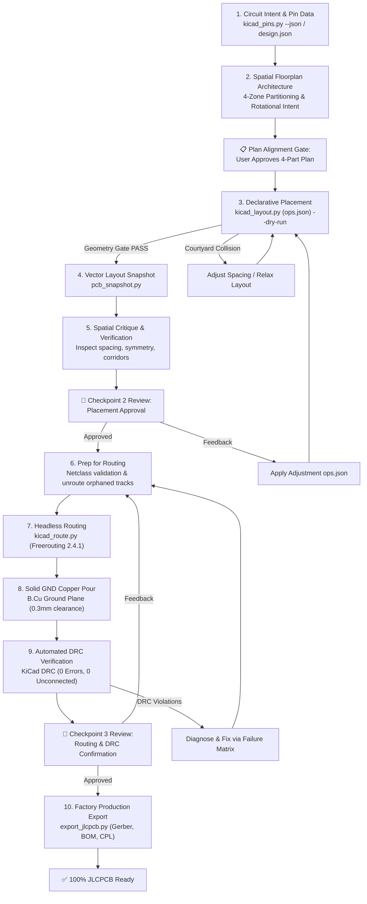

# Agentic Placement Architecture & Spatial Intent Pipeline

## The Core Concept: Vision-Guided Semantic Placement

LLMs lack continuous sub-millimeter geometric awareness. To overcome this limitation, Kaibridge operates on a two-tier division of responsibility:
- **The AI Agent (Lead Hardware Architect):** Dictates semantic and spatial intent via `ops.json` (functional clustering, perimeter outward connector orientation, heatsink tab facing, and IC pin alignment).
- **The Kaibridge Geometry Gate (Deterministic Mason):** Enforces strict 0.5mm grid quantization, verifies non-overlapping courtyards, and executes physics-based micro-relaxation (`kaibridge_auto_relax_layout`).

## Mandatory Rules Reference
Before formulating `ops.json`, consult canonical rulebases in `references/`:
1. [`references/pcb_placement_rules.md`](../references/pcb_placement_rules.md): 80-rule floorplanning doctrine, precedence ladder (§0.3), and proximity tolerances.
2. [`references/trackwidth_clearence_viasize.md`](../references/trackwidth_clearence_viasize.md): Netclasses, track widths, clearances, and via hole/pad sizing.
3. [`references/failure_recovery_matrix.md`](../references/failure_recovery_matrix.md): Exhaustive recovery procedures for layout, DRC, and routing faults.
