<div align="center">
  <h1>Kaibridge</h1>
  <p><b>An end-to-end open-source Model Context Protocol connecting AI agents to KiCad — enabling fully headless PCB design: architecting circuits from natural language, sourcing verified components, compiling multi-sheet schematics, optimizing planar placement, and executing deterministic routing alongside a human engineer in the loop.</b></p>

[](LICENSE)
[](https://www.kicad.org/)
[](https://adoptium.net/)
[](https://www.python.org/)
[](CHANGELOG.md)
[](https://github.com/ShahMdAbid/Kaibridge/commits)

</div>

<br/>

### Documentation

* [Core Capabilities](docs/core-capabilities.md)
* [User Guide](docs/user-guide.md)
* [Changelog](CHANGELOG.md)
* [Contributing Guidelines](docs/contributing.md)
* [Issue Tracker](https://github.com/ShahMdAbid/Kaibridge/issues)

---

## System Architecture
Kaibridge operates in a **Headless mode** rather than an interactive CAD co-pilot. 
The diagram below illustrates how Kaibridge translates natural language circuit requirements into verified PCB production files:

```mermaid
%%{init: {
  'theme': 'base',
  'themeVariables': {
    'primaryColor': '#1e293b',
    'primaryTextColor': '#f8fafc',
    'primaryBorderColor': '#38bdf8',
    'lineColor': '#64748b',
    'secondaryColor': '#0f172a',
    'tertiaryColor': '#18181b',
    'fontFamily': 'Inter, system-ui, -apple-system, Segoe UI, sans-serif',
    'fontSize': '12px'
  }
}}%%
flowchart TD
    %% Styling Definitions
    classDef human fill:#0f172a,stroke:#38bdf8,stroke-width:2px,color:#f8fafc;
    classDef checkpoint fill:#064e3b,stroke:#10b981,stroke-width:2px,color:#ecfdf5;
    classDef artifact fill:#022c22,stroke:#059669,stroke-width:1.5px,color:#d1fae5;
    classDef template fill:#1e1b4b,stroke:#818cf8,stroke-width:1.5px,stroke-dasharray:3 3,color:#e0e7ff;
    classDef process fill:#18181b,stroke:#52525b,stroke-width:1px,color:#f4f4f5;
    classDef gate fill:#451a03,stroke:#f59e0b,stroke-width:2px,color:#fef3c7;
    classDef tool fill:#2e1065,stroke:#a855f7,stroke-width:1.5px,color:#faf5ff;

    subgraph Phase1 ["Phase 1: Requirements & Safety Review"]
        Prompt["<b>User Circuit Prompt</b><br/>Requirements & specs"]
        ART["<b>ART-Gate Review</b><br/>Voltage limits, thermals<br/>& DFM check"]
        Plan["<b>Implementation Plan</b><br/>implementation_plan.md<br/>Delta Table & BOM"]
        Human1{"<b>Human Review</b><br/>User Approval"}

        Prompt --> ART
        ART --> Plan
        Plan --> Human1
    end

    subgraph Phase2 ["Phase 2: Bootstrap & Component Sourcing"]
        Bootstrap["<b>Project Bootstrap</b><br/>kicad_lib_init.py<br/>Native KiCad 10 project"]
        Sourcing["<b>Component Sourcing</b><br/>Offline SQLite Catalog<br/>Golden Master cache"]
        Passives["<b>Native Passives</b><br/>KiCad IPC-7351<br/>R, C, SOD-123"]
        Actives["<b>Active ICs</b><br/>easyeda2kicad<br/>Symbols, Footprints & 3D"]
        PinExtract["<b>Pin Verification</b><br/>kicad_pins.py<br/>Exact pin extraction"]
        DesTemplate["<b>design_template.json</b><br/>Compiler schema"]
        DesignJSON["<b>Circuit Spec</b><br/>design.json<br/>LCSC IDs & Netclasses"]

        Human1 -->|"Approved"| Bootstrap
        Bootstrap --> Sourcing
        Sourcing --> Passives
        Sourcing --> Actives
        Passives --> PinExtract
        Actives --> PinExtract
        PinExtract --> DesignJSON
        DesTemplate -.->|"Governs"| DesignJSON
    end

    subgraph Phase3 ["Phase 3: Schematic Compilation & ERC"]
        Compiler["<b>Schematic Compiler</b><br/>json2sch.py<br/>Multi-sheet .kicad_sch"]
        NetclassRules["<b>Design Rules</b><br/>Trace widths & netclasses<br/>in .kicad_pro"]
        ERCGate{"<b>KiCad ERC Gate</b><br/>0 Errors?"}
        FixSch["<b>Auto-Correction</b><br/>Resolve pin conflicts<br/>& power flags"]
        SchSVG["<b>Checkpoint 1 Preview</b><br/>Vector Schematic SVG"]

        DesignJSON --> Compiler
        Compiler --> NetclassRules
        Compiler --> ERCGate
        ERCGate -->|"Violations"| FixSch
        FixSch -->|"Update spec"| DesignJSON
        ERCGate -->|"0 Errors (Passed)"| SchSVG
    end

    subgraph Phase4 ["Phase 4: Planar Placement & Geometry Gate"]
        SyncPCB["<b>Headless PCB Sync</b><br/>kicad_pcb_sync.py (F8)<br/>Footprints & nets"]
        OpsTemplate["<b>ops_template.json</b><br/>Placement schema"]
        LayoutSpec["<b>Layout Spec</b><br/>ops.json<br/>Universal 4-zone floorplan"]

        subgraph SubGeom ["Geometry Gate & Planar Optimization"]
            PlanarOpt["<b>Planar Optimizer</b><br/>kicad_planar_optimizer.py<br/>Simulated Annealing & Kruskal MST<br/>&gt;85% ratsnest crossing cut"]
            GridQuant["<b>Grid Quantization</b><br/>0.5mm manufacturing grid"]
            DryRun{"<b>Collision Audit</b><br/>--dry-run check"}
            CommitLayout["<b>Commit Placement</b><br/>kicad_layout.py"]
            LockParts["<b>Lock Critical Footprints</b><br/>LCK-01: Connectors, Motifs & ICs"]
        end

        Snapshot["<b>Checkpoint 2 Snapshot</b><br/>pcb_snapshot.py<br/>Vector Board SVG"]
        Human2{"<b>Visual Audit Gate</b><br/>Connector facing, silk hygiene<br/>& mechanical clearance"}

        SchSVG --> SyncPCB
        SyncPCB --> LayoutSpec
        OpsTemplate -.->|"Governs"| LayoutSpec
        LayoutSpec --> PlanarOpt
        PlanarOpt --> GridQuant
        GridQuant --> DryRun
        DryRun -->|"Overlap"| PlanarOpt
        DryRun -->|"0 Collisions"| CommitLayout
        CommitLayout --> LockParts
        LockParts --> Snapshot
        Snapshot --> Human2
    end

    subgraph Phase5 ["Phase 5: Deterministic Routing & DRC Release"]
        Fanout["<b>Adaptive Strategy Routing</b><br/>kicad_route.py<br/>Strategy 1: Dog-Bone Fanout First<br/>Strategy 2: Dual-Layer with Auto-Fallback"]
        DSNAudit["<b>Pre-Flight DSN Audit</b><br/>Clearance harmonization (250µm)<br/>Stale tracks & zones purged"]
        Freeroute["<b>Planar Signal Routing</b><br/>Freerouting 2.4.1 (Java 25 LTS)<br/>REST Daemon (Port 37864), 150µm keepout"]
        SESMerge["<b>Merge Traces</b><br/>SES import to .kicad_pcb"]
        GNDPlane["<b>Solid Ground Flood</b><br/>Continuous copper plane with island removal<br/>B.Cu (2-layer) / In1 & In2 (4-layer)"]
        DRCGate{"<b>KiCad DRC Release Gate</b><br/>0 Clearance Violations<br/>0 Unconnected Nets"}
        RoutedPCB["<b>Checkpoint 3 Verified</b><br/>DRC-clean .kicad_pcb"]

        Human2 -->|"Approved"| Fanout
        Fanout --> DSNAudit
        DSNAudit --> Freeroute
        Freeroute --> SESMerge
        SESMerge --> GNDPlane
        GNDPlane --> DRCGate
        DRCGate -->|"0 DRC Errors"| RoutedPCB
    end

    subgraph Phase6 ["Phase 6: JLCPCB Production Export"]
        ExportEngine["<b>Production Exporter</b><br/>export_jlcpcb.py"]
        ProdBundle["<b>Production Bundle</b><br/>Gerber ZIP, BOM & CPL Centroids"]

        RoutedPCB --> ExportEngine
        ExportEngine --> ProdBundle
    end

    class Human1,Human2 human;
    class SchSVG,Snapshot,RoutedPCB checkpoint;
    class Prompt,Plan,DesignJSON,LayoutSpec,ProdBundle artifact;
    class DesTemplate,OpsTemplate template;
    class ART,Passives,Actives,NetclassRules,FixSch,PlanarOpt,GridQuant,LockParts,Fanout,SESMerge,GNDPlane process;
    class ERCGate,DryRun,DRCGate gate;
    class Bootstrap,Sourcing,PinExtract,Compiler,SyncPCB,CommitLayout,DSNAudit,Freeroute,ExportEngine tool;
```




## Quick Start

### 1. Setup
- **Source Code:** Clone via `git clone https://github.com/ShahMdAbid/Kaibridge.git` or download the standalone release archive [Kaibridge_v2.2.1.zip](https://github.com/ShahMdAbid/Kaibridge/releases/download/v2.2.1/Kaibridge_v2.2.1.zip).
- **Prerequisites:** Ensure KiCad 10 and Java 25 LTS (or Java 17+) are installed and accessible in your environment.
- **Offline Component Database (Optional):** For < 1ms offline component lookup across 16,600+ JLCPCB parts, download [easyeda-std.elib.zip](https://github.com/ShahMdAbid/Kaibridge/releases/download/v2.1.0/easyeda-std.elib.zip) (~142 MB) and extract it into `data/easyeda-std.elib`.
- Add Kaibridge to your agent's MCP configuration (`mcp_config.json`):

```json
{
  "mcpServers": {
    "kaibridge": {
      "command": "python",
      "args": [
        "server.py"
      ]
    }
  }
}
```

### 2. Workflow
1. Start your AI coding agent (e.g., Antigravity IDE).
2. Enter your circuit design requirements.
3. The agent sources components, compiles schematics, verifies ERC, places footprints, and routes the board headlessly. While the engine can operate autonomously, guiding the agent step-by-step through checkpoints is recommended to maintain clear visibility over your design—**AI-generated design suggestions do not replace qualified engineering review**. (See the [User Guide](docs/user-guide.md) for details).

## AI Disclosure

This project was developed with the support of AI-assisted coding tools. AI tools were used to accelerate development — creative decisions and architecture remain entirely with the author(s).


## Disclaimer

This project is provided without any warranty, express or implied. The author(s) accept no liability for damages of any kind arising from the use of this tool, including but not limited to: 

- Errors in generated schematics, PCB layouts, or manufacturing files
- Damage to hardware, components, or devices caused by incorrect designs
- Financial losses due to manufacturing errors or incorrect orders


## License

This project is licensed under the **GNU Affero General Public License v3.0 (AGPL-3.0)**.  
You are free to use and modify this project. However, if you modify the code and make it available over a network (e.g., as a SaaS or web tool), you **must** open-source your modified backend code under the same AGPL-3.0 license.

