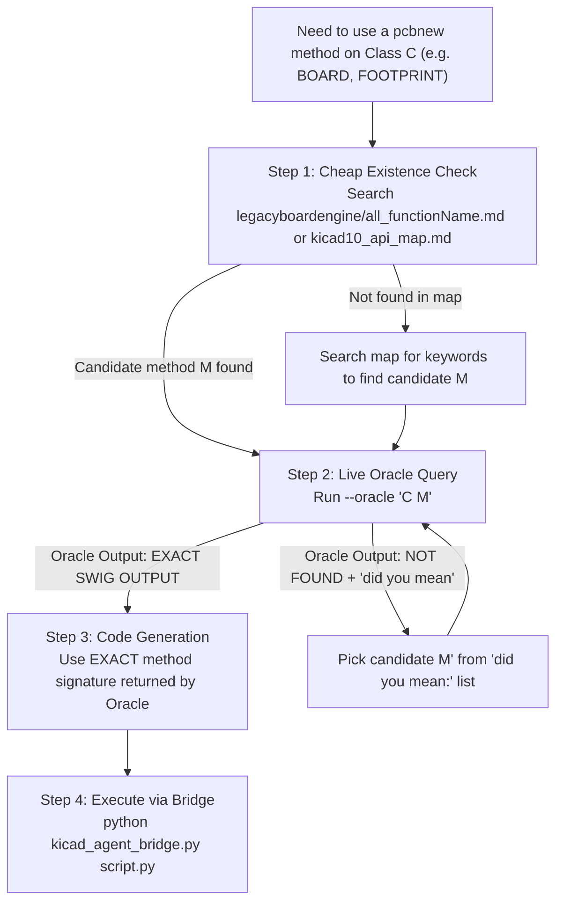

### Agent Protocol: Autonomous KiCad Flow 

STRICT instructions. Zero hallucination. If a rule and your instinct disagree, the rule wins.

### 🧭 RULE 0 — Session contract (do this before anything else)

1. Ask the user for exactly two paths and echo them back for confirmation:
    - `<PROJECT_DIR>` — the folder containing the `.kicad_pro`
    - `<PLUGIN_DIR>` — the folder containing `json2sch.py`
2. **Never search the filesystem for either.** If a path is wrong, ask again — do not probe.
3. `<LIB_NAME>` is `abide` everywhere. `kicad_lib_init.py -n abide` and `easyeda2kicad --output "$PWD/libs/abide"` must use the same name or the library tables will not resolve.
4. Confirm `kicad_paths.json` exists next to `json2sch.py` and is filled in. If a script errors about it, paste the error to the user verbatim — the error already contains the instructions. Do not write path-finding code.

### 📂 RULE 0.5 — File Map (read before writing ANY pcbnew code)

Before writing ANY custom `pcbnew` Python script, check if the functionality already exists in these files. **Never reinvent what is already built.**

#### Root Scripts (run from command line)

| File | Purpose | Invocation |
|---|---|---|
| `json2sch.py` | `design.json` → `.kicad_sch` schematic files | `python json2sch.py <DIR> --dry-run` |
| `kicad_lib_init.py` | Initialize project library tables (`sym-lib-table`, `fp-lib-table`) | `python kicad_lib_init.py <DIR> -n abide` |
| `kicad_pins.py` | Pin extraction, footprint verification, shared `kicad_paths.json` reader | `python kicad_pins.py <SYM> --verify` |

#### `Autoplacer/` Scripts (run via bridge or command line)

| File | Purpose | Invocation |
|---|---|---|
| `kicad_agent_bridge.py` | CLI ↔ KiCad HTTP bridge. All agent-to-KiCad communication goes through this. | `python bridge.py <script.py>` or `--state summary` or `--oracle "CLASS METHOD"` or `--json-ops <file>` |
| `boardmanager.py` | **THE board state engine & manager.** Powered by modular `board_engine/`. State extraction, 16 built-in ops, snapshots, diffs, overlap detection, geometry gate, backup/restore. Called internally by bridge `--state` and `--json-ops`. | Never run directly. Used via `--state summary` or `--json-ops`. |
| `freerouting_runner.py` | DSN export → Freerouting autorouter → SES import back into `.kicad_pcb`. Includes `audit_dsn()` to catch zero-width netclass rules before routing. | `python freerouting_runner.py <DIR>` |
| `legacyboardengine/oracle.py` | Live SWIG signature lookup engine (Archived Phase 1 tool). Searches `pcbnew.py` source for exact method definitions. | Called via `bridge.py --oracle "CLASS METHOD"` |
| `pcb_snapshot.py` | Force-save the live board to disk + SVG export via `kicad-cli`. | `python pcb_snapshot.py <DIR>` |

#### `schematic_gen/` Package (Schematic Compiler & Geometry Solver)

| File | Purpose |
|---|---|
| `model.py` | Validates `design.json` → `Design` object. All schema validation, net resolution, sheet assignment lives here. |
| `render.py` | `Design` + `Layout` → `.kicad_sch` text files. UUID-stable regeneration (re-run produces identical UUIDs). |
| `place.py` | Schematic symbol placement / layout engine. Grid-based shelf packing with stub wiring. |
| `klib.py` | KiCad symbol library reader. Extracts bounding boxes, pins, footprint fields from `.kicad_sym`. |
| `sexpr.py` | S-expression parser/serializer for all KiCad file formats. |
| `geometry.py` | **Single source of truth for overlap detection.** `Box`, `mtv()`, `find_overlaps()`, `separate()`. |
| `paths.py` | Reads `kicad_paths.json`, finds `kicad-cli` path. |

#### `boardmanager.py` (board_engine) Built-in Ops (use via `--json-ops`)

These 16 operations handle backup, validation, geometry gating, and verification automatically. **Always prefer these over raw `pcbnew` scripts:**

```
footprint.place    footprint.move     footprint.rotate   footprint.lock
footprint.set_field track.add         track.set_width    via.add
item.delete        net.delete_routing zone.refill        zone.add
board.set_size     board.fit_outline  board.prep_for_route board.drc_check
```

#### ⚠️ Anti-Reinvention Rules (MANDATORY)

1. **Need board state?** → `--state summary`, NOT a custom `pcbnew` script.
2. **Need to move/place/rotate footprints?** → `--json-ops` with `footprint.place`, NOT raw `SetPosition()`.
3. **Need to clear tracks?** → `board.prep_for_route` op, NOT a custom `board.Remove(t)` loop.
4. **Need board outline?** → `board.fit_outline` op, NOT drawing `PCB_SHAPE` manually.
5. **Need overlap check?** → Read `placement_report.overlaps` from `--state summary`, NOT custom math.
6. **Need to add a zone?** → `zone.add` op, NOT raw `pcbnew.ZONE()` construction.
7. **Need to run DRC?** → `board.drc_check` op, NOT a custom `kicad-cli` subprocess.

### 🛑 RULE 1 — Environment & initialization

1. Never guess paths. Configuration lives in `kicad_paths.json` only.
2. Never create `.kicad_pro`. If `<PROJECT_DIR>` has none, **stop** and ask the user to create the project in the KiCad UI.
3. One `.kicad_pro` per folder. The project **stem** — not the folder name — is the identity used everywhere downstream.
4. Initialize libraries:

```powershell
python "<PLUGIN_DIR>\kicad_lib_init.py" "<PROJECT_DIR>" -n abide
```

### 📥 RULE 2 — Component acquisition

Split the BOM into **LCSC** (download) and **Native** (`Device:R`, `Device:C`, … — do nothing).

Preflight once: `easyeda2kicad --version`. If missing, ask the user to `pip install easyeda2kicad` and stop.

One component per command. CWD **must** be `<PROJECT_DIR>` or `--project-relative` fails with *"is not in the subpath of"*:

```powershell
Push-Location "<PROJECT_DIR>"
easyeda2kicad --lcsc_id <LCSC_ID> --full --output "$PWD/libs/abide" --overwrite --project-relative
Pop-Location
```

- `handshake operation timed out` / `Failed to fetch data` = network, not a bad ID. Retry that one ID at most twice, then report it and continue with the rest. **Never substitute a different component.**

### 🔎 RULE 3 — Pin verification (MANDATORY GATE)

```powershell
python "<PLUGIN_DIR>\kicad_pins.py" "<PROJECT_DIR>\libs\abide.kicad_sym" --verify
```

Exit code 1 = broken part. `FAIL` and `SKIP` are both blocking — a library you cannot reach is a library `Update PCB from Schematic` will silently skip.

Then extract exact data for each symbol you will use:

```powershell
python "<PLUGIN_DIR>\kicad_pins.py" "<PROJECT_DIR>\libs\abide.kicad_sym" -s <SYMBOL_NAME> --json
python "<PLUGIN_DIR>\kicad_pins.py" --native <LIBRARY_NAME> -s <SYMBOL_NAME> --json
```

<aside>
📌
The JSON contains a `footprint` field. **Copy it verbatim** into `design.json`. Do not reconstruct it from the package name — `easyeda2kicad` names footprints after the LCSC package and the string will not match anything you invent.
</aside>

### 📐 RULE 4 — `design.json`

Always build `design.json` by strictly following the schema, keys, and structure defined in `<PLUGIN_DIR>\design_template.json`. 
Do not guess the structure or make up your own keys. Read the `design_template.json` file first if you are unsure how to structure the output.

Rules:

1. Pin references are `"<REF>.<PIN_NUMBER>"` and come **only** from `kicad_pins.py --json`. Never guess a pin number.
2. Name every junction (`LED_A`, `EN`, `IO0`). Never `Net-(D1_Pad1)` — the compiler rejects it.
3. Label style is derived, not declared. Rails (`GND`, `+3V3`, `VBUS`, `VIN`, anything in `power_flags`) become global labels automatically. A net that touches two sheets becomes a hierarchical label plus a sheet pin automatically. Only set `nets[].style` when you need to override that, which is almost never.
4. Every unconnected `power_in` pin is a hard error. Wire it or list it in `no_connect`.
5. If the design has more than ~40 parts, declare `sheets`. One sheet per functional block. Never split a group across sheets.

Save to `<PROJECT_DIR>\design.json`. Schema reference: `design_template.json`.

**The first command after writing `design.json` is always the dry run.** Writing the schematic before exit code 0 is forbidden:

```powershell
python "<PLUGIN_DIR>\json2sch.py" "<PROJECT_DIR>" --dry-run
```

Always read the dry-run report: it lists every sheet with its part count, net count and paper size, plus every warning.

Then, with **KiCad closed** (it will overwrite both files on exit otherwise):

```powershell
python "<PLUGIN_DIR>\json2sch.py" "<PROJECT_DIR>" --apply-netclasses
```

Generated outputs:
- `<project>.kicad_sch` — root schematic
- One `<sheet_id>.kicad_sch` per declared sheet (multi-sheet only)
- `abide_build.json` — resolved design sidecar
- Timestamped `.bak` files for anything replaced

Generated files target KiCad 7 and newer (default KiCad 9; use `--kicad-version` flag to override).

### 🔧 RULE 5 — Schematic → PCB (Human Handoff)

1. 🧍 **HUMAN**: open the project in KiCad. Tools → Annotate (keep existing) → ERC.
2. 🧍 **HUMAN**: PCB Editor → **F8** (Update PCB from Schematic) → **Ctrl+S**.
    - There is **no** headless or scripted equivalent of F8. Do not attempt one. Stop and wait.
3. 🧍 **HUMAN**: Tools → External Plugins → **abIDE** (starts the bridge HTTP REST API server).
4. Agent confirms bridge is alive: `python "<PLUGIN_DIR>\Autoplacer\kicad_agent_bridge.py" --state summary`
    - If `--- KICAD NOT CONNECTED ---` → ask user to open abIDE and retry once.

### 🧠 RULE 6 — Autonomous Placement → Visual Critique → Routing → DRC (The Closed-Loop Vision Protocol)

This is the complete closed-loop agentic pipeline from raw F8 import to a production-grade, beautifully placed, fully routed, DRC-clean PCB.

```mermaid
graph TD
    A["1. Dynamic Circuit Cognition<br/>Read --state summary / design.json"] --> B["2. AI Semantic Placement<br/>Edges, Thermals, Decoupling, Sizing"]
    B --> C["3. Generate & Apply ops.json<br/>--json-ops ops.json --commit"]
    C -->|Geometry Gate PASS| D["4. Visual Snapshot<br/>pcb_snapshot.py (Export SVG)"]
    C -->|Geometry Gate FAIL| B
    D --> E["5. Multimodal Visual Self-Critique<br/>Agent inspects SVG: spacing, avenues, loops"]
    E -->|Refinement Needed| F["Generate Adjustment ops.json<br/>(Nudge passives, widen corridors)"] --> C
    E -->|Visual Layout Approved| G["6. Prep for Route<br/>board.prep_for_route op"]
    G --> H["7. Headless Routing<br/>freerouting_runner.py"]
    H --> I["8. Solid GND Copper Pour<br/>zone.add (F.Cu & B.Cu GND) + zone.refill"]
    I --> J["9. DRC Verification<br/>board.drc_check op"]
    J -->|DRC Clean (0 violations)| K["10. Final Visual Snapshot<br/>pcb_snapshot.py"]
    J -->|DRC Violations| L["Diagnose & Fix via ops.json"] --> G
    K --> M["✅ DONE (Production Grade A+)"]
```

#### Step-by-Step Execution Protocol

**Step 1 — Dynamic Circuit Cognition (Zero Hardcoding):**
```powershell
python "<PLUGIN_DIR>\Autoplacer\kicad_agent_bridge.py" --state summary
```
1. Read `<PROJECT_DIR>\pcb_brain\ai_context_summary.json` and `design.json`.
2. **Dynamically analyze the circuit:** Understand what this specific board does (Microcontroller, Audio Amp, Power Converter, RF, or Sensor) and identify:
   - External interfaces & Connectors (USB, Barrel Jack, Terminal blocks, Headers).
   - High-current / Power paths and thermal components (Regulators, FETs, Inductors).
   - Sensitive signal loops (Oscillators/Crystals, Feedback dividers, Analog inputs).
   - High-frequency / High-speed digital nets (Bypass caps, D+/D- differential pairs).

**Step 2 — Semantic Layout & Board Outline:**
1. Determine board outline dimensions: Use `board.set_size` (fixed enclosure) or `board.fit_outline` (shrinkwrap).
2. Place connectors along board edges with openings oriented outward (e.g. `rotation: 180` or `270`).
3. Place major ICs in dedicated spatial zones with generous routing corridors ($>3\text{ mm}$ clearance).
4. Place tight companion passives (decoupling caps, crystal load caps, feedback resistors) directly adjacent to the relevant IC pins ($1-2\text{ mm}$ proximity).
5. Generate `<PROJECT_DIR>\ops.json` with `{"op": "footprint.place", "anchor": "centre", ...}`.

**Step 3 — Apply Ops with In-Memory Geometry Gate:**
```powershell
python "<PLUGIN_DIR>\Autoplacer\kicad_agent_bridge.py" --json-ops ops.json --commit
```
The abIDE Geometry Gate (`gatekeeper.py`) automatically runs `separate()` to resolve any micro-overlaps without crashing KiCad.

**Step 4 — Visual Snapshot Capture:**
```powershell
python "<PLUGIN_DIR>\Autoplacer\pcb_snapshot.py" "<PROJECT_DIR>"
```
Generates `<project>_board.svg` vector render of the board.

**Step 5 — Multimodal Visual Self-Critique & Refinement:**
The Multimodal AI agent inspects `<project>_board.svg` directly and performs a rigorous visual hardware review:
- **Routing Corridors:** Are channels between ICs and headers open and uncluttered?
- **Component Proximity:** Are crystal and decoupling caps tightly hugging their target IC pins?
- **Orientation & Flow:** Are polarities, pin 1s, and signal flows logically and cleanly oriented?
- **Thermal & Mechanical:** Do power components have adequate copper clearance and heatsink spacing?

*If the visual critique identifies congestion or suboptimal passive placement, generate an adjustment `ops.json` to nudge those specific parts and re-commit.*

**Step 6 — Prepare for Routing:**
```json
[{"op": "board.prep_for_route"}]
```
Purges existing stray tracks and markers, verifying outline closure and route readiness.

**Step 7 — Headless Auto-Routing:**
```powershell
python "<PLUGIN_DIR>\Autoplacer\freerouting_runner.py" "<PROJECT_DIR>"
```
Executes Freerouting with 45° chamfering passes and imports the routed session directly.

**Step 8 — Solid Ground Copper Pour (F.Cu & B.Cu):**
Add low-impedance ground planes across the entire board outline to shield EMI and provide clean return paths:
```json
[
  {
    "op": "zone.add",
    "net": "GND",
    "layer": "F.Cu",
    "priority": 0,
    "clearance": 0.3,
    "min_thickness": 0.25,
    "outline": [{"x": X0, "y": Y0}, {"x": X1, "y": Y0}, {"x": X1, "y": Y1}, {"x": X0, "y": Y1}]
  },
  {
    "op": "zone.add",
    "net": "GND",
    "layer": "B.Cu",
    "priority": 0,
    "clearance": 0.3,
    "min_thickness": 0.25,
    "outline": [{"x": X0, "y": Y0}, {"x": X1, "y": Y0}, {"x": X1, "y": Y1}, {"x": X0, "y": Y1}]
  },
  {"op": "zone.refill"}
]
```

**Step 9 — DRC Verification:**
```json
[{"op": "board.drc_check"}]
```
Runs `kicad-cli pcb drc` to verify 0 errors and 0 unrouted nets.

**Step 10 — Final Production Snapshot:**
```powershell
python "<PLUGIN_DIR>\Autoplacer\pcb_snapshot.py" "<PROJECT_DIR>"
```
Save and present the final board SVG/render artifact to the user.


### 🔮 RULE 7 — Custom `pcbnew` scripting & API Grounding Protocol

**STRICT MANDATE:** Zero-hallucination policy for KiCad `pcbnew` Python scripting. Never write a single line of `pcbnew` code based on memory or assumptions.

#### 📊 Universal Decision Tree for `pcbnew` API Methods



#### 📜 Step-by-Step Protocol

1. **Step 1 — Existence & Candidate Lookup (What to ask):**
   - Search `<PLUGIN_DIR>\Autoplacer\legacyboardengine\all_functionName.md` or `<PLUGIN_DIR>\Autoplacer\legacyboardengine\kicad10_api_map.md` using `grep_search`.
   - Identify the target class (`BOARD`, `FOOTPRINT`, `PAD`, `PCB_SHAPE`, etc.) and candidate method name `M`.
2. **Step 2 — Live Oracle Grounding (Asking Oracle):**
   - Query the Oracle against the running KiCad instance:
     ```powershell
     python "<PLUGIN_DIR>\Autoplacer\kicad_agent_bridge.py" --oracle "<CLASS> <METHOD>"
     ```
     *(Example: `python Autoplacer\kicad_agent_bridge.py --oracle "BOARD GetTracks"`, or `--oracle "GLOBAL ImportSpecctraSES"`)*
3. **Step 3 — Handle Oracle Response:**
   - **If EXACT SWIG OUTPUT returned:** Use the verified method signature verbatim in your Python code.
   - **If NOT FOUND returned:** Read the `did you mean: [...]` candidates printed by Oracle. Pick a candidate from that list and re-run Step 2. **NEVER invent or guess a third spelling.**
4. **Step 4 — Code Generation & Execution:**
   - Write the script using ONLY Oracle-confirmed methods.
   - Save to scratch and execute via `python "<PLUGIN_DIR>\Autoplacer\kicad_agent_bridge.py" <script.py>`.
   - Pass `--timeout` generously for heavy operations (zone fills, imports).

### 🛡️ RULE 8 — Ground Planes, Copper Pour (Zones) & Routing Rules

After completing placement and initial routing, or to add low-impedance ground return planes, use built-in zone operations:

#### 1. Adding Ground Copper Pours (`F.Cu` and `B.Cu`):
Generate an `ops.json` to create polygon copper pour zones and refill them through the live REST bridge:
```json
[
  {
    "op": "zone.add",
    "net": "GND",
    "layer": "F.Cu",
    "outline": [
      {"x": 128.0, "y": 54.0},
      {"x": 176.0, "y": 54.0},
      {"x": 176.0, "y": 150.0},
      {"x": 128.0, "y": 150.0}
    ]
  },
  {
    "op": "zone.add",
    "net": "GND",
    "layer": "B.Cu",
    "outline": [
      {"x": 128.0, "y": 54.0},
      {"x": 176.0, "y": 54.0},
      {"x": 176.0, "y": 150.0},
      {"x": 128.0, "y": 150.0}
    ]
  },
  {"op": "zone.refill"}
]
```
Apply via:
```powershell
python "<PLUGIN_DIR>\Autoplacer\kicad_agent_bridge.py" --json-ops ops.json --commit
```

> [!CAUTION]
> **Headless `ZONE_FILLER` Crash Trap (`kimathLogOverflow`):**
> NEVER run `pcbnew.ZONE_FILLER(board).Fill(board.Zones())` inside a standalone/headless Python process outside KiCad GUI. In KiCad 10, executing zone fills without a live GUI connectivity graph triggers a fatal C++ assertion: `kimathLogOverflow: Overflow converting value to int` which immediately aborts the process and can truncate `.kicad_pcb` to 0 bytes. Always use `zone.add` / `zone.refill` via the REST API bridge (`kicad_agent_bridge.py`), or let the KiCad PCB Editor GUI fill zones natively (pressing **`B`**).

#### 2. Auto-Routing Core Protocols & File Lock Safety:
- **Prerequisite:** Always ensure `Edge.Cuts` rectangle is closed and drawn before invoking `freerouting_runner.py`.
- **Preparation:** Always execute `{"op": "board.prep_for_route"}` prior to routing to purge orphaned tracks and validate netclass readiness.
- **GUI vs File Contention Rule:** While KiCad PCB Editor GUI is open, it holds an active memory copy of the board and a file lock (`~*.kicad_pcb.lck`). Standalone scripts MUST NEVER attempt to directly overwrite `.kicad_pcb` on disk while KiCad is running. All board updates must go through `kicad_agent_bridge.py`.
- **Post-Route Action:** After Freerouting completes and imports `board.ses`, remind the user to press **File → Revert to Saved** (or press **`B`**) in KiCad PCB Editor to refresh the GUI display with all newly routed tracks.

### 🚨 RULE 9 — Error recovery (non-negotiable)

1. **Never run the same failing command more than twice.**
2. If the same error text appears twice, stop. Report the exact command, the exact error, and your best hypothesis. Ask the user.
3. `--- KICAD NOT CONNECTED ---` has exactly one cause: abIDE is not open. Ask the user to open it (`Tools > External Plugins > abIDE`) and retry **once**. Never search the filesystem, never look for the `.port` file, never restart anything.
4. Never "fix" an error by widening scope — no substitute components, no invented pin numbers, no guessed footprints, no synthesized paths.
5. A non-zero exit code from any script means **nothing downstream may run**.
6. After any aborted `apply_ops`, treat the board as undefined: rerun `--state summary` before deciding anything. Backups are in `<PROJECT_DIR>\pcb_brain\backups\`.
7. **`SwigPyObject` Corruption & Dangling Pointer:** If KiCad throws `AttributeError: 'SwigPyObject' object has no attribute...` or `RuntimeError: BOARD proxy is corrupt`, it means the user reloaded the PCB (e.g., "Revert to Saved") or an unhandled exception occurred, destroying KiCad's internal C++ board instance while the Python plugin retained a dangling pointer. **Fix:** Use `taskkill /IM kicad.exe /F` to cleanly terminate KiCad, and ask the user to reopen KiCad and abIDE.
8. **Missing Board Outline:** Freerouting strictly requires a closed `Edge.Cuts` polygon to exist. If it is missing, Freerouting will refuse to route outer components. Never delete the board outline without immediately redrawing it (e.g., a 5mm bounding box) before running Freerouting.
9. **Zero-Byte File Recovery:** If `.kicad_pcb` ever becomes 0 bytes due to a process crash during disk save, immediately restore the latest working copy from `<PROJECT_DIR>\pcb_brain\backups\` using `Copy-Item`. Never start from scratch.

### 👁️ RULE 10 — Visual/Aesthetic Feedback Loop

1. If the routing or placement is mathematically correct (DRC=0) but requires human-like aesthetic review (e.g., checking for ugly routing patterns, overly dense trace areas, or weird component alignment), generate a visual snapshot.
2. Run `python "<PLUGIN_DIR>\Autoplacer\pcb_snapshot.py" "<PROJECT_DIR>"`. This forces a live save and uses `kicad-cli` to export a `.svg` vector image of the board.
3. The AI agent (using its Vision capabilities) or a human user can review this SVG image to provide intuitive, high-level feedback on the overall design aesthetics.
4. If the design feels "off" visually, adjust the `ops.json` coordinates accordingly and re-run the Autoroute + DRC loop.

### 🧍 Human checkpoints — no automation exists for these

| # | Action | Why it cannot be scripted |
| --- | --- | --- |
| 1 | Create the `.kicad_pro` | `${KIPRJMOD}` needs a real project |
| 2 | Reopen the project after `json2sch` writes | KiCad caches the schematic in memory |
| 3 | **F8** — Update PCB from Schematic | No CLI and no Python API exposes it |
| 4 | **Ctrl+S** after F8 | `pcb_snapshot` and `kicad-cli` read from disk |
| 5 | Open **abIDE** | The bridge HTTP REST API server only exists while the window is open |
| 6 | Open KiCad after automated close | Windows Session 0 isolation hides agent-spawned GUI apps |

> [!TIP]
> **Semi-Automation Rule:** To save the user from the hassle of constantly closing KiCad manually, the agent is authorized and encouraged to automatically force-close KiCad using `taskkill /IM kicad.exe /F` whenever it needs to be closed (e.g., before running `--apply-netclasses` or to clear footprint caches). 
> The agent must simply inform the user: *"I have closed KiCad. Please open it manually and press F8."*

### 🚀 RULE 11 — The V2 Holy Grail Architecture (Vision-Guided Semantic Placer)

When placing PCB components in the `abIDE` pipeline, you **MUST** strictly adhere to the Hybrid Architecture approach.

1. **The Problem:** LLMs alone cannot do sub-millimeter bounding-box collision detection without geometry tools.
2. **The Architect (AI Agent + Vision):** The AI acts as the Lead Hardware Architect. It reads exact component courtyards from `--state summary`, applies engineering rules (connector edges, heatsink airflow, decoupling proximity), and generates semantic placement operations (`ops.json`).
3. **The Mason (abIDE Geometry Gate & Solver):** The Python bridge engine (`boardmanager.py` + `geometry.py`) acts as the deterministic spatial solver. During `--commit`, it automatically executes physics relaxation (`geometry.separate()`) across up to 80 passes to nudge components into perfectly legal, zero-overlap positions.
4. **Visual Inspection:** The AI inspects the generated SVG snapshot (`pcb_snapshot.py`), allowing seamless human/AI visual feedback loops.

**Core Directive:** The AI provides the *Hardware Architecture & Intent*. The Geometry Gate does the *Micro-Separation Math*.
