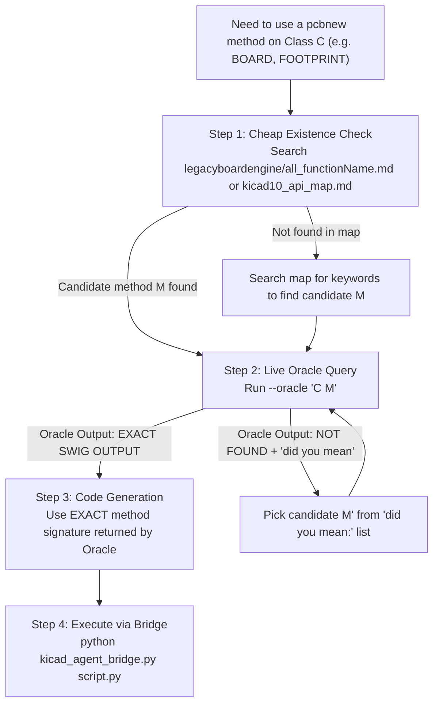

### Agent Protocol: Autonomous KiCad Flow 

STRICT instructions. Zero hallucination. If a rule and your instinct disagree, the rule wins.

### 🧭 RULE 0 — Session contract (do this before anything else)

1. Ask the user for exactly two paths and echo them back for confirmation:
    - `<PROJECT_DIR>` — the folder containing the `.kicad_pro`
    - `<PLUGIN_DIR>` — the folder containing `json2sch.py`
2. **Never search the filesystem for either.** If a path is wrong, ask again — do not probe.
3. `<LIB_NAME>` is `abide` everywhere. `kicad_lib_init.py -n abide` and `easyeda2kicad --output "$PWD/libs/abide"` must use the same name or the library tables will not resolve.
4. Confirm `kicad_paths.json` exists next to `json2sch.py` and is filled in. If a script errors about it, paste the error to the user verbatim — the error already contains the instructions. Do not write path-finding code.

### 📂 RULE 0.5 — File Map (read before writing ANY pcbnew code)

Before writing ANY custom `pcbnew` Python script, check if the functionality already exists in these files. **Never reinvent what is already built.**

#### Root Scripts (run from command line)

| File | Purpose | Invocation |
|---|---|---|
| `json2sch.py` | `design.json` → `.kicad_sch` schematic files | `python json2sch.py <DIR> --dry-run` |
| `kicad_lib_init.py` | Initialize project library tables (`sym-lib-table`, `fp-lib-table`) | `python kicad_lib_init.py <DIR> -n abide` |
| `kicad_pins.py` | Pin extraction, footprint verification, shared `kicad_paths.json` reader | `python kicad_pins.py <SYM> --verify` |

#### `Autoplacer/` Scripts (run via bridge or command line)

| File | Purpose | Invocation |
|---|---|---|
| `kicad_agent_bridge.py` | CLI ↔ KiCad HTTP bridge. All agent-to-KiCad communication goes through this. | `python bridge.py <script.py>` or `--state summary` or `--oracle "CLASS METHOD"` or `--json-ops <file>` |
| `boardmanager.py` | **THE board state engine & manager.** Powered by modular `board_engine/`. State extraction, 16 built-in ops, snapshots, diffs, overlap detection, geometry gate, backup/restore. Called internally by bridge `--state` and `--json-ops`. | Never run directly. Used via `--state summary` or `--json-ops`. |
| `freerouting_runner.py` | DSN export → Freerouting autorouter → SES import back into `.kicad_pcb`. Includes `audit_dsn()` to catch zero-width netclass rules before routing. | `python freerouting_runner.py <DIR>` |
| `legacyboardengine/oracle.py` | Live SWIG signature lookup engine (Archived Phase 1 tool). Searches `pcbnew.py` source for exact method definitions. | Called via `bridge.py --oracle "CLASS METHOD"` |
| `pcb_snapshot.py` | Force-save the live board to disk + SVG export via `kicad-cli`. | `python pcb_snapshot.py <DIR>` |

#### `schematic_gen/` Package (Schematic Compiler & Geometry Solver)

| File | Purpose |
|---|---|
| `model.py` | Validates `design.json` → `Design` object. All schema validation, net resolution, sheet assignment lives here. |
| `render.py` | `Design` + `Layout` → `.kicad_sch` text files. UUID-stable regeneration (re-run produces identical UUIDs). |
| `place.py` | Schematic symbol placement / layout engine. Grid-based shelf packing with stub wiring. |
| `klib.py` | KiCad symbol library reader. Extracts bounding boxes, pins, footprint fields from `.kicad_sym`. |
| `sexpr.py` | S-expression parser/serializer for all KiCad file formats. |
| `geometry.py` | **Single source of truth for overlap detection.** `Box`, `mtv()`, `find_overlaps()`, `separate()`. |
| `paths.py` | Reads `kicad_paths.json`, finds `kicad-cli` path. |

#### `boardmanager.py` (board_engine) Built-in Ops (use via `--json-ops`)

These 14 operations handle backup, validation, geometry gating, and verification automatically. **Always prefer these over raw `pcbnew` scripts:**

```
footprint.place    footprint.move     footprint.rotate   footprint.lock
footprint.set_field track.add         track.set_width    via.add
item.delete        net.delete_routing board.set_size     board.fit_outline
board.prep_for_route board.drc_check
```

#### ⚠️ Anti-Reinvention Rules (MANDATORY)

1. **Need board state?** → `--state summary`, NOT a custom `pcbnew` script.
2. **Need to move/place/rotate footprints?** → `--json-ops` with `footprint.place`, NOT raw `SetPosition()`.
3. **Need to clear tracks?** → `board.prep_for_route` op, NOT a custom `board.Remove(t)` loop.
4. **Need board outline?** → `board.fit_outline` op, NOT drawing `PCB_SHAPE` manually.
5. **Need overlap check?** → Read `placement_report.overlaps` from `--state summary`, NOT custom math.
6. **Need to add a zone?** → **STOP.** Do not use `zone.add` or raw scripts. Ground pouring is a manual human task.
7. **Need to run DRC?** → `board.drc_check` op, NOT a custom `kicad-cli` subprocess.

### 🛑 RULE 1 — Environment & initialization

1. Never guess paths. Configuration lives in `kicad_paths.json` only.
2. Never create `.kicad_pro`. If `<PROJECT_DIR>` has none, **stop** and ask the user to create the project in the KiCad UI.
3. One `.kicad_pro` per folder. The project **stem** — not the folder name — is the identity used everywhere downstream.
4. Initialize libraries:

```powershell
python "<PLUGIN_DIR>\kicad_lib_init.py" "<PROJECT_DIR>" -n abide
```

### 📥 RULE 2 — Component acquisition

Split the BOM into **LCSC** (download) and **Native** (`Device:R`, `Device:C`, … — do nothing).

Preflight once: `easyeda2kicad --version`. If missing, ask the user to `pip install easyeda2kicad` and stop.

One component per command. CWD **must** be `<PROJECT_DIR>` or `--project-relative` fails with *"is not in the subpath of"*:

```powershell
Push-Location "<PROJECT_DIR>"
easyeda2kicad --lcsc_id <LCSC_ID> --full --output "$PWD/libs/abide" --overwrite --project-relative
Pop-Location
```

- `handshake operation timed out` / `Failed to fetch data` = network, not a bad ID. Retry that one ID at most twice, then report it and continue with the rest. **Never substitute a different component.**

### 🔎 RULE 3 — Pin verification (MANDATORY GATE)

```powershell
python "<PLUGIN_DIR>\kicad_pins.py" "<PROJECT_DIR>\libs\abide.kicad_sym" --verify
```

Exit code 1 = broken part. `FAIL` and `SKIP` are both blocking — a library you cannot reach is a library `Update PCB from Schematic` will silently skip.

Then extract exact data for each symbol you will use:

```powershell
python "<PLUGIN_DIR>\kicad_pins.py" "<PROJECT_DIR>\libs\abide.kicad_sym" -s <SYMBOL_NAME> --json
python "<PLUGIN_DIR>\kicad_pins.py" --native <LIBRARY_NAME> -s <SYMBOL_NAME> --json
```

<aside>
📌
The JSON contains a `footprint` field. **Copy it verbatim** into `design.json`. Do not reconstruct it from the package name — `easyeda2kicad` names footprints after the LCSC package and the string will not match anything you invent.
</aside>

### 📐 RULE 4 — `design.json`

Always build `design.json` by strictly following the schema, keys, and structure defined in `<PLUGIN_DIR>\design_template.json`. 
Do not guess the structure or make up your own keys. Read the `design_template.json` file first if you are unsure how to structure the output.

Rules:

1. Pin references are `"<REF>.<PIN_NUMBER>"` and come **only** from `kicad_pins.py --json`. Never guess a pin number.
2. Name every junction (`LED_A`, `EN`, `IO0`). Never `Net-(D1_Pad1)` — the compiler rejects it.
3. Label style is derived, not declared. Rails (`GND`, `+3V3`, `VBUS`, `VIN`, anything in `power_flags`) become global labels automatically. A net that touches two sheets becomes a hierarchical label plus a sheet pin automatically. Only set `nets[].style` when you need to override that, which is almost never.
4. Every unconnected `power_in` pin is a hard error. Wire it or list it in `no_connect`.
5. If the design has more than ~40 parts, declare `sheets`. One sheet per functional block. Never split a group across sheets.

Save to `<PROJECT_DIR>\design.json`. Schema reference: `design_template.json`.

**The first command after writing `design.json` is always the dry run.** Writing the schematic before exit code 0 is forbidden:

```powershell
python "<PLUGIN_DIR>\json2sch.py" "<PROJECT_DIR>" --dry-run
```

Always read the dry-run report: it lists every sheet with its part count, net count and paper size, plus every warning.

**Automated ERC Verification & Generation (MANDATORY):**
Then, with **KiCad closed** (it will overwrite files on exit otherwise), you must generate the schematic, apply netclasses, and verify it is electrically sound in one command using the `--erc` flag:

```powershell
python "<PLUGIN_DIR>\json2sch.py" "<PROJECT_DIR>" --apply-netclasses --erc
```

Read the console output. If you see severe violations (like `[ERROR] Pin not connected (Symbol R11 Pin 1)`), it means you have a typo in your `design.json` net labels. Fix the `design.json` and re-run the command. Only proceed to the human handoff when the schematic is clean.

Generated outputs:
- `<project>.kicad_sch` — root schematic
- One `<sheet_id>.kicad_sch` per declared sheet (multi-sheet only)
- `abide_build.json` — resolved design sidecar
- Timestamped `.bak` files for anything replaced

Generated files target KiCad 7 and newer (default KiCad 9; use `--kicad-version` flag to override).

*(Note: While the schematic generator supports targeting KiCad 7+, the abIDE PCB plugin and bridge itself requires KiCad 10.)*

### 🔧 RULE 5 — Schematic → PCB (Human Handoff)

1. 🧍 **HUMAN**: open the project in KiCad. Tools → Annotate (keep existing) → ERC.
2. 🧍 **HUMAN**: PCB Editor → **F8** (Update PCB from Schematic) → **Ctrl+S**.
    - There is **no** headless or scripted equivalent of F8. Do not attempt one. Stop and wait.
3. 🧍 **HUMAN**: Tools → External Plugins → **abIDE** (starts the bridge HTTP REST API server).
4. Agent confirms bridge is alive: `python "<PLUGIN_DIR>\Autoplacer\kicad_agent_bridge.py" --state summary`
    - If `--- KICAD NOT CONNECTED ---` → ask user to open abIDE and retry once.

### 🧠 RULE 6 — Autonomous Placement → Visual Critique → Routing → DRC (The Closed-Loop Vision Protocol)

**Placement principle:**
The agent provides spatial intent through `ops.json`.
Never assume the LLM's coordinates are geometrically valid.
All placement must pass the Geometry Gate.
(See `docs/architecture/agentic-placement.md` for the full conceptual architecture).

#### Step-by-Step Execution Protocol

**Step 1 — Dynamic Circuit Cognition & Vision-Driven Implementation Plan:**
```powershell
python "<PLUGIN_DIR>\Autoplacer\kicad_agent_bridge.py" --state summary
```
1. Read `<PROJECT_DIR>\pcb_brain\ai_context_summary.json` and `design.json`.
2. **Activate Multimodal Visual Critique Sense:** Dynamically reason across the circuit's functional topology (Sensors, MCU, Power, or Connectors).
3. Draft a comprehensive `implementation_plan.md` outlining proposed board outline, connector positions, companion passive groupings, and spatial flow.

**Step 2 — Human Alignment Gate (Top Priority Rule):**
1. Ask the user if the proposed design matches their intended physical layout.
2. **STRICT PRIORITY RULE:** If the user provides specific guidelines, reference pictures, symmetry rules (e.g., `[Resistor_Left] [Sensor] [Resistor_Right]`), connector orientations, or form-factor constraints, the agent **MUST** prioritize the user's instructions over all generic heuristics.
3. If no specific user override is given, proceed according to the approved plan.

**Step 3 — Generate & Apply `ops.json` with In-Memory Geometry Gate:**
1. Translate the aligned spatial architecture into `<PROJECT_DIR>\ops.json` with exact non-overlapping coordinates.
2. Apply via bridge:
```powershell
python "<PLUGIN_DIR>\Autoplacer\kicad_agent_bridge.py" --json-ops ops.json --commit
```
The abIDE Geometry Gate (`gatekeeper.py`) verifies zero courtyard collisions and closes `Edge.Cuts`.

**Step 4 — Visual Snapshot Export:**
```powershell
python "<PLUGIN_DIR>\Autoplacer\pcb_snapshot.py" "<PROJECT_DIR>"
```
Generates `<project>_board.svg` vector render of the physical board.

**Step 5 — 🧍 Human Checkpoint 1 (Placement Approval & Iterative Critique Loop):**
1. Present the snapshot SVG and detailed spatial critique table to the user.
2. Explicitly ask: *"Is the component placement approved to proceed to routing?"*
3. **If Approved (YES):** Proceed immediately to Step 6 (`board.prep_for_route`) and Step 7 (`freerouting_runner.py`).
4. **If Feedback / Rejected (NO):**
   - **Do NOT proceed to routing.**
   - Capture the current SVG snapshot using `pcb_snapshot.py`.
   - Re-analyze the board using the agent's spatial critique brain in conjunction with the user's specific feedback.
   - Generate adjustment `ops.json`, apply with `--commit`, export new snapshot SVG, and present back to the user in the same iterative review loop until approved.

##### 🧠 Spatial Critique Framework (Used during Step 5):

The agent evaluates the board visual render by **synchronizing canonical engineering rules** ([pcb_placement_rules.md](skillset/pcb_placement_rules.md) and [trackwidth_clearence_viasize.md](skillset/trackwidth_clearence_viasize.md)) with its **Multimodal Spatial Reasoning Brain**.

###### 📊 Structured Visual Feedback Format:
The agent MUST output its findings in this structured critique table before executing adjustments:

| Ref | Current Visual Observation | Engineering / Skillset Rule Reference | Severity | Corrective Action | Target Coordinate / Rotation |
|---|---|---|---|---|---|
| `C1` | Placed 5.2mm away from MCU VDD pin | Decoupling Hierarchy (`pcb_placement_rules.md` §2.C) | High | Nudge closer to pin 18 | `x: 132.5, y: 84.0, rot: 90` |
| `Y1` | Wide loop area between crystal & OSC pins | EMI / Oscillator Loop Area | Medium | Move directly above pins 7-8 | `x: 125.0, y: 78.0, rot: 0` |
| `U2` | Heatsink tab pointing inward toward MCU | Thermal Dissipation (`pcb_placement_rules.md` §2.B) | High | Rotate 180° so tab faces board edge | `x: 140.0, y: 65.0, rot: 270` |
| `R1, R2` | Staggered irregularly | Visual Symmetry & Alignment | Low | Align Y coordinate to 92.0mm | `x: 118.0, y: 92.0, rot: 0` |

###### 🔄 Critique-to-Ops Translation:
Convert the corrective actions directly into an adjustment `ops.json`:
```json
[
  {"op": "footprint.place", "anchor": "centre", "ref": "C1", "x": 132.5, "y": 84.0, "rotation": 90},
  {"op": "footprint.place", "anchor": "centre", "ref": "Y1", "x": 125.0, "y": 78.0, "rotation": 0},
  {"op": "footprint.place", "anchor": "centre", "ref": "U2", "x": 140.0, "y": 65.0, "rotation": 270},
  {"op": "footprint.place", "anchor": "centre", "ref": "R1", "x": 118.0, "y": 92.0, "rotation": 0},
  {"op": "footprint.place", "anchor": "centre", "ref": "R2", "x": 122.0, "y": 92.0, "rotation": 0}
]
```
Apply the adjustment via `python Autoplacer/kicad_agent_bridge.py --json-ops ops.json --commit` and re-verify.


**Step 6 — Prepare for Routing:**
```json
[{"op": "board.prep_for_route"}]
```
Purges existing stray tracks and markers, verifying outline closure and route readiness.


**Step 7 — Headless Auto-Routing (File-Lock Safe):**
> [!WARNING]
> **File-Lock Contention:** `freerouting_runner.py` edits the `.kicad_pcb` file directly on disk. You MUST ask the user to save their board (`Ctrl+S`) before running this command, and Revert to Saved after it finishes.

1. **Ask User:** "Please press `Ctrl+S` to save your board and do not make any edits. I am starting the auto-router."
2. **Execute:** 
```powershell
python "<PLUGIN_DIR>\Autoplacer\freerouting_runner.py" "<PROJECT_DIR>"
```
3. **Ask User:** "Routing is complete! Please go to **File → Revert to Saved** in KiCad to load the routed tracks."

**Step 8 — 🧍 Human Checkpoint (Ground Copper Pour):**
Ground pouring via JSON is deprecated due to KiCad thread-lock crashes. 
Instruct the user to manually draw the GND copper zones:
1. Ask the user: "Please use the 'Add a filled zone' tool in KiCad to draw a GND zone on `F.Cu` and `B.Cu` around the board outline, and press **`B`** to fill them. Save the board (`Ctrl+S`) when done."
2. Wait for the user to confirm they have filled the zones and saved before proceeding to DRC.

**Step 9 — DRC Verification:**
```json
[{"op": "board.drc_check"}]
```
Runs `kicad-cli pcb drc` to verify 0 errors and 0 unrouted nets.

**Step 10 — Final Production Snapshot:**
```powershell
python "<PLUGIN_DIR>\Autoplacer\pcb_snapshot.py" "<PROJECT_DIR>"
```
Save and present the final board SVG/render artifact to the user.


### 🔮 RULE 7 — Custom `pcbnew` scripting & API Grounding Protocol

**STRICT MANDATE:** Zero-hallucination policy for KiCad `pcbnew` Python scripting. Never write a single line of `pcbnew` code based on memory or assumptions.

#### 📊 Universal Decision Tree for `pcbnew` API Methods



#### 📜 Step-by-Step Protocol

1. **Step 1 — Existence & Candidate Lookup (What to ask):**
   - Search `<PLUGIN_DIR>\Autoplacer\legacyboardengine\all_functionName.md` or `<PLUGIN_DIR>\Autoplacer\legacyboardengine\kicad10_api_map.md` using `grep_search`.
   - Identify the target class (`BOARD`, `FOOTPRINT`, `PAD`, `PCB_SHAPE`, etc.) and candidate method name `M`.
2. **Step 2 — Live Oracle Grounding (Asking Oracle):**
   - Query the Oracle against the running KiCad instance:
     ```powershell
     python "<PLUGIN_DIR>\Autoplacer\kicad_agent_bridge.py" --oracle "<CLASS> <METHOD>"
     ```
     *(Example: `python Autoplacer\kicad_agent_bridge.py --oracle "BOARD GetTracks"`, or `--oracle "GLOBAL ImportSpecctraSES"`)*
3. **Step 3 — Handle Oracle Response:**
   - **If EXACT SWIG OUTPUT returned:** Use the verified method signature verbatim in your Python code.
   - **If NOT FOUND returned:** Read the `did you mean: [...]` candidates printed by Oracle. Pick a candidate from that list and re-run Step 2. **NEVER invent or guess a third spelling.**
4. **Step 4 — Code Generation & Execution:**
   - Write the script using ONLY Oracle-confirmed methods.
   - Save to scratch and execute via `python "<PLUGIN_DIR>\Autoplacer\kicad_agent_bridge.py" <script.py>`.
   - Pass `--timeout` generously for heavy operations (zone fills, imports).

### 🛡️ RULE 8 — Ground Planes, Copper Pour & Routing Safety

#### 1. Ground Copper Pour Protocol (Manual):
- Ground pouring is a manual human task. NEVER invoke `pcbnew.ZONE_FILLER` or use `zone.add` via JSON.
- Instruct the user to draw and fill zones natively in KiCad PCB Editor and press **`B`** to refill.

#### 2. Auto-Routing Core Protocols & File Lock Safety:
- **Prerequisite:** Always ensure `Edge.Cuts` rectangle is closed and drawn before invoking `freerouting_runner.py`.
- **Preparation:** Always execute `{"op": "board.prep_for_route"}` prior to routing to purge orphaned tracks and validate netclass readiness.
- **GUI vs File Contention Rule:** While KiCad PCB Editor GUI is open, it holds an active memory copy of the board and a file lock (`~*.kicad_pcb.lck`). Standalone scripts MUST NEVER attempt to directly overwrite `.kicad_pcb` on disk while KiCad is running. All board updates must go through `kicad_agent_bridge.py`.
- **Exception (Freerouting):** `freerouting_runner.py` is the *only* exception to the file-lock rule. Because it overwrites the file directly, you MUST coordinate with the user: instruct them to Save before routing, and use **File → Revert to Saved** immediately after.

### 🚨 RULE 9 — Failure Recovery

**If bridge reports KICAD NOT CONNECTED:**
- ask user to open the abIDE plugin.
- retry exactly once.
- do not start another bridge.

**If geometry gate fails:**
- do not bypass the gate.
- inspect `placement_report`.
- generate corrective `ops.json`.

**If DRC fails:**
- do not declare success.
- classify violations.
- correct through supported operations.
- rerun DRC.

**If component download fails:**
- retry the same component at most twice.
- never silently substitute another component.

**If pin verification fails:**
- do not proceed.
- do not invent pin mappings.
- inform the user and stop.

**If `SwigPyObject` corruption occurs:**
- ask user to manually save (`Ctrl+S`).
- ask user to close KiCad and reopen.
- do not use `taskkill` unless user confirms KiCad is frozen.

**If `.kicad_pcb` becomes 0 bytes:**
- restore latest working copy from `backups/` using `Copy-Item`.
- never start from scratch.

**If `Edge.Cuts` is missing before Freerouting:**
- redraw it before running Freerouting.

**If the same error text appears twice:**
- stop.
- report the exact command and error.
- ask the user.

### 👁️ RULE 10 — Visual/Aesthetic Feedback Loop

1. If the routing or placement is mathematically correct (DRC=0) but requires human-like aesthetic review (e.g., checking for ugly routing patterns, overly dense trace areas, or weird component alignment), generate a visual snapshot.
2. Run `python "<PLUGIN_DIR>\Autoplacer\pcb_snapshot.py" "<PROJECT_DIR>"`. This forces a live save and uses `kicad-cli` to export a `.svg` vector image of the board.
3. The AI agent (using its Vision capabilities) or a human user can review this SVG image to provide intuitive, high-level feedback on the overall design aesthetics.
4. If the design feels "off" visually, adjust the `ops.json` coordinates accordingly and re-run the Autoroute + DRC loop.

### 🧍 Human checkpoints — no automation exists for these

| # | Action | Why it cannot be scripted |
| --- | --- | --- |
| 1 | Create the `.kicad_pro` | `${KIPRJMOD}` needs a real project |
| 2 | Reopen the project after `json2sch` writes | KiCad caches the schematic in memory |
| 3 | **F8** — Update PCB from Schematic | No CLI and no Python API exposes it |
| 4 | **Ctrl+S** after F8 | `pcb_snapshot` and `kicad-cli` read from disk |
| 5 | Open **abIDE** | The bridge HTTP REST API server only exists while the window is open |
| 6 | Open KiCad after automated close | Windows Session 0 isolation hides agent-spawned GUI apps |
| 7 | **Design Alignment Gate (Checkpoint 0)** | Confirm layout strategy and prioritize user-specific placement / symmetry directives |
| 8 | **Placement Approval (Checkpoint 1)** | Human engineer validates physical layout, spacing, and connector orientation before triggering router |
| 9 | **Routing Approval & Ground Pour (Checkpoint 2)** | Human engineer inspects trace topologies and manually draws/fills GND copper zones (automated zone fills crash KiCad's OpenMP thread) |

> [!TIP]
> **Semi-Automation Rule (Safe Closing):** To save the user from the hassle of dealing with frozen windows, the agent is authorized to force-close KiCad using `taskkill /IM kicad.exe /F` ONLY if the user explicitly confirms they have saved their work (`Ctrl+S`) or if the application is completely unresponsive. 
> The agent must always ask first: *"Please save your work. May I close KiCad for you?"*
