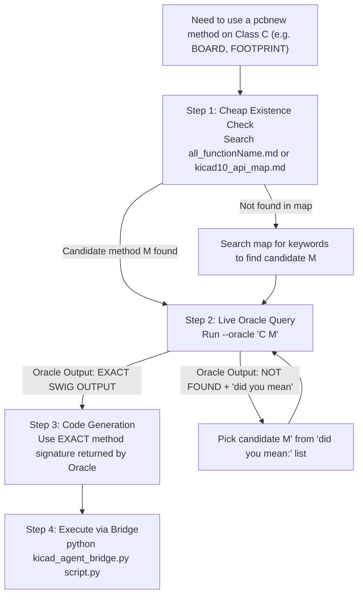

### Agent Protocol: Autonomous KiCad Flow 

STRICT instructions. Zero hallucination. If a rule and your instinct disagree, the rule wins.

### 🧭 RULE 0 — Session contract (do this before anything else)

1. Ask the user for exactly two paths and echo them back for confirmation:
    - `<PROJECT_DIR>` — the folder containing the `.kicad_pro`
    - `<PLUGIN_DIR>` — the folder containing `json2sch.py`
2. **Never search the filesystem for either.** If a path is wrong, ask again — do not probe.
3. `<LIB_NAME>` is `abide` everywhere. `kicad_lib_init.py -n abide` and `easyeda2kicad --output "$PWD/libs/abide"` must use the same name or the library tables will not resolve.
4. Confirm `kicad_paths.json` exists next to `json2sch.py` and is filled in. If a script errors about it, paste the error to the user verbatim — the error already contains the instructions. Do not write path-finding code.

### 📂 RULE 0.5 — File Map (read before writing ANY pcbnew code)

Before writing ANY custom `pcbnew` Python script, check if the functionality already exists in these files. **Never reinvent what is already built.**

#### Root Scripts (run from command line)

| File | Purpose | Invocation |
|---|---|---|
| `json2sch.py` | `design.json` → `.kicad_sch` schematic files | `python json2sch.py <DIR> --dry-run` |
| `kicad_lib_init.py` | Initialize project library tables (`sym-lib-table`, `fp-lib-table`) | `python kicad_lib_init.py <DIR> -n abide` |
| `kicad_pins.py` | Pin extraction, footprint verification, shared `kicad_paths.json` reader | `python kicad_pins.py <SYM> --verify` |
| `abide_pcb.py` | Orchestrator (place → route → check loop with budget) | `python abide_pcb.py <DIR> --step auto` |

#### `Autoplacer/` Scripts (run via bridge or command line)

| File | Purpose | Invocation |
|---|---|---|
| `kicad_agent_bridge.py` | CLI ↔ KiCad HTTP bridge. All agent-to-KiCad communication goes through this. | `python bridge.py <script.py>` or `--state summary` or `--oracle "CLASS METHOD"` or `--json-ops <file>` |
| `currentboardfetcher.py` | **THE board state engine (1400 lines).** State extraction, 16 built-in ops, snapshots, diffs, overlap detection, geometry gate, backup/restore. Called internally by bridge `--state` and `--json-ops`. | Never run directly. Used via `--state summary` or `--json-ops`. |
| `freerouting_runner.py` | DSN export → Freerouting autorouter → SES import back into `.kicad_pcb`. Includes `audit_dsn()` to catch zero-width netclass rules before routing. | `python freerouting_runner.py <DIR>` |
| `macro_placer.py` | Untangle footprints from the (0,0) pile into grouped clusters using `design.json` groups. | `python macro_placer.py <DIR>` |
| `oracle.py` | Live SWIG signature lookup engine. Searches `pcbnew.py` source for exact method definitions. | Called via `bridge.py --oracle "CLASS METHOD"` |
| `pcb_snapshot.py` | Force-save the live board to disk + SVG export via `kicad-cli`. | `python pcb_snapshot.py <DIR>` |

#### `abide/` Package (imported by other scripts, never run directly)

| File | Purpose |
|---|---|
| `model.py` | Validates `design.json` → `Design` object. All schema validation, net resolution, sheet assignment lives here. |
| `render.py` | `Design` + `Layout` → `.kicad_sch` text files. UUID-stable regeneration (re-run produces identical UUIDs). |
| `place.py` | Schematic symbol placement / layout engine. Grid-based shelf packing with stub wiring. |
| `klib.py` | KiCad symbol library reader. Extracts bounding boxes, pins, footprint fields from `.kicad_sym`. |
| `sexpr.py` | S-expression parser/serializer for all KiCad file formats. |
| `geometry.py` | **Single source of truth for overlap detection.** `Box`, `mtv()`, `find_overlaps()`, `separate()`. |
| `paths.py` | Reads `kicad_paths.json`, finds `kicad-cli` path. |

#### `currentboardfetcher.py` Built-in Ops (use via `--json-ops`)

These 16 operations handle backup, validation, geometry gating, and verification automatically. **Always prefer these over raw `pcbnew` scripts:**

```
footprint.place    footprint.move     footprint.rotate   footprint.lock
footprint.set_field track.add         track.set_width    via.add
item.delete        net.delete_routing zone.refill        zone.add
board.set_size     board.fit_outline  board.prep_for_route board.drc_check
```

#### ⚠️ Anti-Reinvention Rules (MANDATORY)

1. **Need board state?** → `--state summary`, NOT a custom `pcbnew` script.
2. **Need to move/place/rotate footprints?** → `--json-ops` with `footprint.place`, NOT raw `SetPosition()`.
3. **Need to clear tracks?** → `board.prep_for_route` op, NOT a custom `board.Remove(t)` loop.
4. **Need board outline?** → `board.fit_outline` op, NOT drawing `PCB_SHAPE` manually.
5. **Need overlap check?** → Read `placement_report.overlaps` from `--state summary`, NOT custom math.
6. **Need to add a zone?** → `zone.add` op, NOT raw `pcbnew.ZONE()` construction.
7. **Need to run DRC?** → `board.drc_check` op, NOT a custom `kicad-cli` subprocess.

### 🛑 RULE 1 — Environment & initialization

1. Never guess paths. Configuration lives in `kicad_paths.json` only.
2. Never create `.kicad_pro`. If `<PROJECT_DIR>` has none, **stop** and ask the user to create the project in the KiCad UI.
3. One `.kicad_pro` per folder. The project **stem** — not the folder name — is the identity used everywhere downstream.
4. Initialize libraries:

```powershell
python "<PLUGIN_DIR>\kicad_lib_init.py" "<PROJECT_DIR>" -n abide
```

### 📥 RULE 2 — Component acquisition

Split the BOM into **LCSC** (download) and **Native** (`Device:R`, `Device:C`, … — do nothing).

Preflight once: `easyeda2kicad --version`. If missing, ask the user to `pip install easyeda2kicad` and stop.

One component per command. CWD **must** be `<PROJECT_DIR>` or `--project-relative` fails with *"is not in the subpath of"*:

```powershell
Push-Location "<PROJECT_DIR>"
easyeda2kicad --lcsc_id <LCSC_ID> --full --output "$PWD/libs/abide" --overwrite --project-relative
Pop-Location
```

- `handshake operation timed out` / `Failed to fetch data` = network, not a bad ID. Retry that one ID at most twice, then report it and continue with the rest. **Never substitute a different component.**

### 🔎 RULE 3 — Pin verification (MANDATORY GATE)

```powershell
python "<PLUGIN_DIR>\kicad_pins.py" "<PROJECT_DIR>\libs\abide.kicad_sym" --verify
```

Exit code 1 = broken part. `FAIL` and `SKIP` are both blocking — a library you cannot reach is a library `Update PCB from Schematic` will silently skip.

Then extract exact data for each symbol you will use:

```powershell
python "<PLUGIN_DIR>\kicad_pins.py" "<PROJECT_DIR>\libs\abide.kicad_sym" -s <SYMBOL_NAME> --json
python "<PLUGIN_DIR>\kicad_pins.py" --native <LIBRARY_NAME> -s <SYMBOL_NAME> --json
```

<aside>
📌
The JSON contains a `footprint` field. **Copy it verbatim** into `design.json`. Do not reconstruct it from the package name — `easyeda2kicad` names footprints after the LCSC package and the string will not match anything you invent.
</aside>

### 📐 RULE 4 — `design.json`

Always build `design.json` by strictly following the schema, keys, and structure defined in `<PLUGIN_DIR>\design_template.json`. 
Do not guess the structure or make up your own keys. Read the `design_template.json` file first if you are unsure how to structure the output.

Rules:

1. Pin references are `"<REF>.<PIN_NUMBER>"` and come **only** from `kicad_pins.py --json`. Never guess a pin number.
2. Name every junction (`LED_A`, `EN`, `IO0`). Never `Net-(D1_Pad1)` — the compiler rejects it.
3. Label style is derived, not declared. Rails (`GND`, `+3V3`, `VBUS`, `VIN`, anything in `power_flags`) become global labels automatically. A net that touches two sheets becomes a hierarchical label plus a sheet pin automatically. Only set `nets[].style` when you need to override that, which is almost never.
4. Every unconnected `power_in` pin is a hard error. Wire it or list it in `no_connect`.
5. If the design has more than ~40 parts, declare `sheets`. One sheet per functional block. Never split a group across sheets.

Save to `<PROJECT_DIR>\design.json`. Schema reference: `design_template.json`.

**The first command after writing `design.json` is always the dry run.** Writing the schematic before exit code 0 is forbidden:

```powershell
python "<PLUGIN_DIR>\json2sch.py" "<PROJECT_DIR>" --dry-run
```

Always read the dry-run report: it lists every sheet with its part count, net count and paper size, plus every warning.

Then, with **KiCad closed** (it will overwrite both files on exit otherwise):

```powershell
python "<PLUGIN_DIR>\json2sch.py" "<PROJECT_DIR>" --apply-netclasses
```

Generated outputs:
- `<project>.kicad_sch` — root schematic
- One `<sheet_id>.kicad_sch` per declared sheet (multi-sheet only)
- `abide_build.json` — resolved sidecar for `macro_placer.py`
- Timestamped `.bak` files for anything replaced

Generated files target KiCad 7 and newer (default KiCad 9; use `--kicad-version` flag to override).

### 🔧 RULE 5 — Schematic → PCB (Human Handoff)

1. 🧍 **HUMAN**: open the project in KiCad. Tools → Annotate (keep existing) → ERC.
2. 🧍 **HUMAN**: PCB Editor → **F8** (Update PCB from Schematic) → **Ctrl+S**.
    - There is **no** headless or scripted equivalent of F8. Do not attempt one. Stop and wait.
3. 🧍 **HUMAN**: Tools → External Plugins → **abIDE** (starts the bridge HTTP REST API server).
4. Agent confirms bridge is alive: `python "<PLUGIN_DIR>\Autoplacer\kicad_agent_bridge.py" --state summary`
    - If `--- KICAD NOT CONNECTED ---` → ask user to open abIDE and retry once.

### 🧠 RULE 6 — Placement → Routing → DRC (Full Iterative Pipeline)

This is the complete iterative loop from raw F8 pile to a fully routed, DRC-clean board. Follow this flowchart:

```mermaid
graph TD
    A["1. Initial Untangle<br/>macro_placer.py"] --> B["2. Get Board State<br/>--state summary"]
    B --> C["3. Read placement_report<br/>Check overlaps, outside_outline, route_ready"]
    C -->|overlaps or outside| D["4a. Fix Placement<br/>Write ops.json with footprint.place ops"]
    C -->|route_ready = true| E["5. Prep for Route<br/>board.prep_for_route op"]
    D --> F["4b. Apply Ops<br/>--json-ops ops.json --commit"]
    F -->|Geometry Gate PASS<br/>auto-separation resolved overlaps| G["4c. Verify<br/>--state summary again"]
    F -->|Geometry Gate FAIL<br/>unsolvable overlap| D
    G --> C
    E --> H["6. Route<br/>freerouting_runner.py"]
    H -->|Routing Success| I["7. DRC Check<br/>board.drc_check op"]
    H -->|Routing Failure| J{"Diagnose"}
    J -->|Zero-width netclass| K["Re-run json2sch --apply-netclasses<br/>User: F8 again"]
    J -->|No board outline| L["Add board.fit_outline op<br/>Go back to step 4a"]
    I -->|DRC Clean (0 violations)| M["8. Snapshot & Review<br/>pcb_snapshot.py"]
    I -->|DRC Violations| N["Fix violations<br/>Go back to step 4a"]
    M --> O["✅ DONE"]
```

#### Step-by-Step Commands

**Step 1 — Initial Untangle** (only needed once, right after F8):
```powershell
python "<PLUGIN_DIR>\Autoplacer\macro_placer.py" "<PROJECT_DIR>"
```
This reads `design.json` groups and spreads the footprints from the (0,0) pile into organized clusters.

**Step 2 — Get Board State** (run this EVERY time before making placement decisions):
```powershell
python "<PLUGIN_DIR>\Autoplacer\kicad_agent_bridge.py" --state summary
```
This writes `<PROJECT_DIR>\pcb_brain\ai_context_summary.json`. Read that file. The SVG is for aesthetics only.

**Step 3 — Read `placement_report`:**
- `overlaps` — list of overlapping footprint pairs with `move_b_by` escape vectors
- `outside_outline` — footprints that extend past `Edge.Cuts`
- `route_ready` — `true` only when overlaps=0, outline_closed=true, all inside, netclasses have width
- `footprints_without_courtyard` — these need manual attention

**Step 4a — Write Placement Ops:**
- Use `{\"op\": \"footprint.place\", \"anchor\": \"centre\"}` — NEVER raw `position_mm` (that's pin 1, not centre).
- Include `{\"op\": \"board.fit_outline\", \"margin\": 5.0}` to auto-generate the board outline.

Example `ops.json`:
```json
[
  {"op": "board.fit_outline", "margin": 5.0},
  {"op": "footprint.place", "anchor": "centre", "ref": "U1", "x": 55.0, "y": 25.0, "rotation": 0},
  {"op": "footprint.place", "anchor": "centre", "ref": "C1", "x": 58.5, "y": 22.0, "rotation": 270}
]
```

**Step 4b — Apply Ops (with built-in auto-separation):**
```powershell
python "<PLUGIN_DIR>\Autoplacer\kicad_agent_bridge.py" --json-ops ops.json --commit
```

> [!IMPORTANT]
> **Auto-Separation is built in!** When `apply_ops` runs with `--commit`, it automatically executes a **Geometry Gate** after applying your ops:
> 1. It runs `placement_report()` to detect any remaining overlaps.
> 2. If overlaps exist, it calls `geometry.separate()` — a relaxation algorithm that nudges unlocked parts apart along the shortest escape vector (like magnets repelling) for up to 80 passes.
> 3. Parts are clamped inside the board outline boundaries.
> 4. The result includes `auto_separated: {ref: [new_x, new_y]}` showing what was nudged.
> 5. Only if `separate()` STILL can't resolve overlaps (e.g., locked parts blocking) does it reject the batch.
>
> **You do NOT need to write custom overlap detection or separation code. The engine handles it.**

**Step 4c — Verify:**
Rerun `--state summary` and check `placement_report.route_ready`. If `false`, fix the reported issues and loop back to Step 4a.

**Step 5 — Prep for Route** (clears old tracks + validates readiness):
Write an ops.json with:
```json
[{"op": "board.prep_for_route"}]
```
This removes ALL existing tracks/vias, runs `placement_report()`, and raises an error if the board is not route-ready (missing outline, overlaps, zero-width netclasses).

**Step 6 — Route:**
```powershell
python "<PLUGIN_DIR>\Autoplacer\freerouting_runner.py" "<PROJECT_DIR>"
```
After routing, tell user: **File → Revert to Saved** (Freerouting writes directly to the `.kicad_pcb` file on disk).

**Step 7 — DRC Check:**
```json
[{"op": "board.drc_check"}]
```
This saves the board, runs `kicad-cli pcb drc`, and returns violation count.

**Step 8 — Snapshot & Visual Review:**
```powershell
python "<PLUGIN_DIR>\Autoplacer\pcb_snapshot.py" "<PROJECT_DIR>"
```
This exports an SVG for visual/aesthetic review. If the design looks wrong, adjust ops and loop back.

### 🔮 RULE 7 — Custom `pcbnew` scripting & API Grounding Protocol

**STRICT MANDATE:** Zero-hallucination policy for KiCad `pcbnew` Python scripting. Never write a single line of `pcbnew` code based on memory or assumptions.

#### 📊 Universal Decision Tree for `pcbnew` API Methods



#### 📜 Step-by-Step Protocol

1. **Step 1 — Existence & Candidate Lookup (What to ask):**
   - Search `<PLUGIN_DIR>\Autoplacer\all_functionName.md` or `<PLUGIN_DIR>\kicad10_api_map.md` using `grep_search`.
   - Identify the target class (`BOARD`, `FOOTPRINT`, `PAD`, `PCB_SHAPE`, etc.) and candidate method name `M`.
2. **Step 2 — Live Oracle Grounding (Asking Oracle):**
   - Query the Oracle against the running KiCad instance:
     ```powershell
     python "<PLUGIN_DIR>\Autoplacer\kicad_agent_bridge.py" --oracle "<CLASS> <METHOD>"
     ```
     *(Example: `python Autoplacer\kicad_agent_bridge.py --oracle "BOARD GetTracks"`, or `--oracle "GLOBAL ImportSpecctraSES"`)*
3. **Step 3 — Handle Oracle Response:**
   - **If EXACT SWIG OUTPUT returned:** Use the verified method signature verbatim in your Python code.
   - **If NOT FOUND returned:** Read the `did you mean: [...]` candidates printed by Oracle. Pick a candidate from that list and re-run Step 2. **NEVER invent or guess a third spelling.**
4. **Step 4 — Code Generation & Execution:**
   - Write the script using ONLY Oracle-confirmed methods.
   - Save to scratch and execute via `python "<PLUGIN_DIR>\Autoplacer\kicad_agent_bridge.py" <script.py>`.
   - Pass `--timeout` generously for heavy operations (zone fills, imports).

### 🔄 RULE 8 — Automated Full Pipeline (shortcut)

If you want to skip the manual loop above, use the orchestrator:

```powershell
python "<PLUGIN_DIR>\abide_pcb.py" "<PROJECT_DIR>" --step auto
```

This runs the entire Place → Route → Check loop automatically with a budget of 4 iterations.

Error handling for `abide_pcb.py`:
- `OVERLAP` / `OUTSIDE_OUTLINE` → apply the `fix` vector provided in the response.
- `NETCLASS_ZERO_WIDTH` → rerun `json2sch.py --apply-netclasses` with KiCad closed, then F8.
- `ROUTER_OOM` / `ROUTER_TIMEOUT` → pass `--heap` or `--timeout` flags, or simplify placement.

### 🚨 RULE 9 — Error recovery (non-negotiable)

1. **Never run the same failing command more than twice.**
2. If the same error text appears twice, stop. Report the exact command, the exact error, and your best hypothesis. Ask the user.
3. `--- KICAD NOT CONNECTED ---` has exactly one cause: abIDE is not open. Ask the user to open it and retry **once**. Never search the filesystem, never look for the `.port` file, never restart anything.
4. Never "fix" an error by widening scope — no substitute components, no invented pin numbers, no guessed footprints, no synthesized paths.
5. A non-zero exit code from any script means **nothing downstream may run**.
6. After any aborted `apply_ops`, treat the board as undefined: rerun `--state summary` before deciding anything. Backups are in `<PROJECT_DIR>\pcb_brain\backups\`.
7. `SwigPyObject` corruption: If KiCad throws `AttributeError: 'SwigPyObject' object has no attribute...` during a bridge call, it means the user reloaded the PCB (e.g., "Revert to Saved") and broke the internal C++ Python pointer. **Automate the fix:** Use `taskkill /IM kicad.exe /F` to forcefully kill the entire KiCad application and flush the ghost pointer, then politely ask the user to reopen KiCad and the abIDE plugin.
8. Missing Board Outline: Freerouting strictly requires a closed `Edge.Cuts` polygon to exist. If it is missing, Freerouting will refuse to route outer components, and KiCad will throw a "Board outline is malformed" warning. Never delete the board outline without immediately redrawing it (e.g., a 5mm bounding box) before running Freerouting.

### 👁️ RULE 10 — Visual/Aesthetic Feedback Loop

1. If the routing or placement is mathematically correct (DRC=0) but requires human-like aesthetic review (e.g., checking for ugly routing patterns, overly dense trace areas, or weird component alignment), generate a visual snapshot.
2. Run `python "<PLUGIN_DIR>\Autoplacer\pcb_snapshot.py" "<PROJECT_DIR>"`. This forces a live save and uses `kicad-cli` to export a `.svg` vector image of the board.
3. The AI agent (using its Vision capabilities) or a human user can review this SVG image to provide intuitive, high-level feedback on the overall design aesthetics.
4. If the design feels "off" visually, adjust the `ops.json` coordinates accordingly and re-run the Autoroute + DRC loop.

### 🧍 Human checkpoints — no automation exists for these

| # | Action | Why it cannot be scripted |
| --- | --- | --- |
| 1 | Create the `.kicad_pro` | `${KIPRJMOD}` needs a real project |
| 2 | Reopen the project after `json2sch` writes | KiCad caches the schematic in memory |
| 3 | **F8** — Update PCB from Schematic | No CLI and no Python API exposes it |
| 4 | **Ctrl+S** after F8 | `pcb_snapshot` and `kicad-cli` read from disk |
| 5 | Open **abIDE** | The bridge HTTP REST API server only exists while the window is open |
| 6 | Open KiCad after automated close | Windows Session 0 isolation hides agent-spawned GUI apps |

> [!TIP]
> **Semi-Automation Rule:** To save the user from the hassle of constantly closing KiCad manually, the agent is authorized and encouraged to automatically force-close KiCad using `taskkill /IM kicad.exe /F` whenever it needs to be closed (e.g., before running `--apply-netclasses` or to clear footprint caches). 
> The agent must simply inform the user: *"I have closed KiCad. Please open it manually and press F8."*

### 🚀 RULE 11 — The V2 Holy Grail Architecture (Vision-Guided Algorithmic Placer)

When developing or executing V2 of the `abIDE` pipeline, you **MUST** strictly adhere to the Hybrid Architecture approach for PCB placement. Do not attempt to rely on pure AI hallucination of coordinates.

1. **The Problem:** LLMs (even Vision models) cannot reliably do 2D floating-point math or sub-millimeter bounding-box collision detection. If the AI is forced to guess explicit `X, Y` coordinates in `ops.json` for 50+ components, the result will be a overlapping "joga khicuri" (mess) that violates basic physics.
2. **The Architect (AI Agent + Vision):** The AI should act purely as the semantic architect. It looks at the SVG snapshot to understand the global flow and writes *rules/constraints* (e.g., "J1 must be on TOP_EDGE", "C1 must be within 2mm of U1.VCC") or proposes an *approximate* intent.
3. **The Mason (Python Engine):** The Python codebase (the `macro_placer.py` or equivalent V2 engine) MUST act as the deterministic spatial solver. It reads the AI's constraints, queries KiCad for the exact footprint bounding boxes (courtyards), and runs a mathematical packing/repulsion algorithm (like grid-shifting or force-directed layout) to snap the components into perfectly legal, zero-overlap positions.

**Core V2 Directive:** The AI provides the *Engineering Intent*. Python does the *Geometry Math*. Never mix the two.
