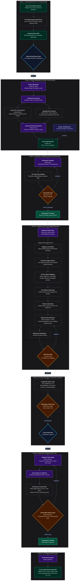

# Kaibridge System Architecture

```mermaid
%%{init: {
  'theme': 'base',
  'themeVariables': {
    'primaryColor': '#1e293b',
    'primaryTextColor': '#f8fafc',
    'primaryBorderColor': '#38bdf8',
    'lineColor': '#64748b',
    'secondaryColor': '#0f172a',
    'tertiaryColor': '#18181b',
    'fontFamily': 'Inter, system-ui, -apple-system, Segoe UI, sans-serif',
    'fontSize': '12px'
  }
}}%%
flowchart TD
    %% Styling Definitions
    classDef human fill:#0f172a,stroke:#38bdf8,stroke-width:2px,color:#f8fafc;
    classDef checkpoint fill:#064e3b,stroke:#10b981,stroke-width:2px,color:#ecfdf5;
    classDef artifact fill:#022c22,stroke:#059669,stroke-width:1.5px,color:#d1fae5;
    classDef template fill:#1e1b4b,stroke:#818cf8,stroke-width:1.5px,stroke-dasharray:3 3,color:#e0e7ff;
    classDef process fill:#18181b,stroke:#52525b,stroke-width:1px,color:#f4f4f5;
    classDef gate fill:#451a03,stroke:#f59e0b,stroke-width:2px,color:#fef3c7;
    classDef tool fill:#2e1065,stroke:#a855f7,stroke-width:1.5px,color:#faf5ff;

    subgraph Phase1 ["Phase 1: Circuit Requirements & Pre-Flight Review"]
        Prompt["<b>User Circuit Requirements</b><br/>Voltage rails, buses, sensors & interfaces"]
        ART["<b>Pre-Flight Engineering Review</b><br/>Inrush current, thermals, reverse polarity & DFM"]
        Plan["<b>Implementation Plan</b><br/>BOM specification & connectivity delta table"]
        Human1{"<b>Engineering Review Gate</b><br/>User approval before initialization"}

        Prompt --> ART
        ART --> Plan
        Plan --> Human1
    end

    subgraph Phase2 ["Phase 2: Project Initialization & Ground-Truth Sourcing"]
        Bootstrap["<b>Project Bootstrap</b><br/>kicad_lib_init.py<br/>Initialize project, lib tables & rules"]
        Sourcing["<b>Component Sourcing</b><br/>Dynamic LCSC / IPC Basic Parts"]
        Actives["<b>Active ICs & Connectors</b><br/>easyeda2kicad<br/>Official symbols, footprints & 3D models"]
        Passives["<b>Standard IPC Passives</b><br/>Standard IPC-7351 footprints<br/>Pre-bound zero-fee Basic Part C-IDs"]
        PinExtract["<b>Ground-Truth Pin Extraction</b><br/>kicad_pins.py<br/>Exact pin numbers, names & types"]
        DesTemplate["<b>design_template.json</b><br/>Canonical Schema 3 blueprint"]
        DesignJSON["<b>Circuit Specification</b><br/>design.json<br/>Parts, nets & netclasses"]

        Human1 -->|"Approved"| Bootstrap
        Bootstrap --> Sourcing
        Sourcing --> Actives
        Sourcing --> Passives
        Actives --> PinExtract
        Passives --> PinExtract
        PinExtract --> DesignJSON
        DesTemplate -.->|"Governs"| DesignJSON
    end

    subgraph Phase3 ["Phase 3: Schematic Compilation & Electrical Rules Gate"]
        Compiler["<b>Schematic Compiler</b><br/>json2sch.py<br/>Hierarchical KiCad 10 S-expressions"]
        PinHeal["<b>Pin Type Auto-Healing</b><br/>Resolves unspecified pins & power flags"]
        ERCGate{"<b>KiCad ERC Gate</b><br/>kicad-cli sch erc<br/>0 Errors required"}
        SchSVG["<b>Checkpoint 1 Preview</b><br/>Vector schematic preview (SVG)"]

        DesignJSON --> Compiler
        Compiler --> PinHeal
        PinHeal --> ERCGate
        ERCGate -->|"0 Errors (Passed)"| SchSVG
        ERCGate -->|"Violations"| Compiler
    end

    subgraph Phase4 ["Phase 4: Headless PCB Sync & Staged Placement"]
        SyncPCB["<b>Headless Netlist Sync</b><br/>kicad_pcb_sync.py (F8)<br/>Bind footprints & airwires"]
        
        subgraph StagedIngestion ["Staged Placement Protocol"]
            StagingLot["<b>Staging Lot Isolation</b><br/>Keep unplaced parts outside board boundary"]
            Bedrock["<b>Perimeter Edge Anchors</b><br/>Lock edge connectors with outward mating clearance"]
            FreeSpace["<b>2D Free-Space Mapping</b><br/>kicad_inspect.py --free-space<br/>Density metrics & rectangular pockets"]
            SiliconDrop["<b>Core Silicon Placement</b><br/>Position primary ICs in largest free pockets"]
            PassiveCluster["<b>Passive Clustering</b><br/>Cluster bypass caps & pull-ups near target pins"]
            PushShove["<b>Elastic Push-and-Shove</b><br/>kicad_layout.py --shove<br/>Centroid penetration & non-colliding escape vectors"]
            SilkSanitize["<b>Silkscreen Sanitization</b><br/>--sanitize-silk auto-cleanup"]
        end

        GeomGate{"<b>Geometry Gate</b><br/>--dry-run check<br/>0 Collisions & 0 Staging"}

        SchSVG --> SyncPCB
        SyncPCB --> StagingLot
        StagingLot --> Bedrock
        Bedrock --> FreeSpace
        FreeSpace --> SiliconDrop
        SiliconDrop --> PassiveCluster
        PassiveCluster --> PushShove
        PushShove --> SilkSanitize
        SilkSanitize --> GeomGate
        GeomGate -->|"Collisions"| PushShove
    end

    subgraph Phase5 ["Phase 5: 3D Visual Inspection & Placement Verification"]
        VisionSuite["<b>9-Angle 3D Vision Suite</b><br/>pcb_snapshot.py --3d<br/>Top orthogonal, 4x isometric corners, 4x side elevations"]
        GatekeeperProof{"<b>Gatekeeper Audit Proof</b><br/>placement_audit()<br/>route_ready: True"}
        Human2{"<b>Visual Audit Gate</b><br/>Checkpoint 2 sign-off"}

        GeomGate -->|"0 Collisions"| VisionSuite
        VisionSuite --> GatekeeperProof
        GatekeeperProof -->|"Audit Passed"| Human2
    end

    subgraph Phase6 ["Phase 6: Autonomous Routing & DRC Gate"]
        Router["<b>Adaptive Autorouting</b><br/>kicad_route.py<br/>Fanout-first single layer vs Dual-layer maze"]
        FreerouteEngine["<b>Freerouting 2.4.1 Daemon</b><br/>Persistent background REST service"]
        GroundFlood["<b>Continuous Ground Pour</b><br/>Solid copper flood on B.Cu / inner layers<br/>Island removal & sub-stub pruning"]
        DRCGate{"<b>KiCad DRC Release Gate</b><br/>kicad-cli pcb drc<br/>0 Clearance Errors & 0 Unconnected Nets"}
        RoutedPCB["<b>Checkpoint 3 Verified</b><br/>DRC-clean .kicad_pcb"]

        Human2 -->|"Approved"| Router
        Router --> FreerouteEngine
        FreerouteEngine --> GroundFlood
        GroundFlood --> DRCGate
        DRCGate -->|"0 DRC Errors"| RoutedPCB
        DRCGate -->|"Violations"| Router
    end

    subgraph Phase7 ["Phase 7: JLCPCB Production Export"]
        Exporter["<b>Production Exporter</b><br/>export_jlcpcb.py"]
        ProdBundle["<b>Factory Manufacturing Bundle</b><br/>Gerber RS-274X ZIP, Excellon Drills,<br/>LCSC-populated BOM & DFM-ROT CPL CSV"]

        RoutedPCB --> Exporter
        Exporter --> ProdBundle
    end

    class Human1,Human2 human;
    class SchSVG,RoutedPCB checkpoint;
    class Prompt,Plan,DesignJSON,ProdBundle artifact;
    class DesTemplate template;
    class ART,Passives,Actives,PinHeal,StagingLot,Bedrock,FreeSpace,SiliconDrop,PassiveCluster,PushShove,SilkSanitize,VisionSuite,GroundFlood process;
    class ERCGate,GeomGate,GatekeeperProof,DRCGate gate;
    class Bootstrap,Sourcing,PinExtract,Compiler,SyncPCB,Router,FreerouteEngine,Exporter tool;
```
